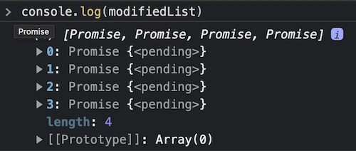

While working on a task today, I had to populate my array of objects using my database.

Instinctively, I used the `map` function. The code looked something like this:

```javascript
const dataList = [
  { type: 'test__1' }, 
  { type: 'test__2' },
  { type: 'test__3' },
  { type: 'test__4' }
];

const modifiedList = dataList.map(async (item) => {
  // Get additional properties from DB
  const dataFromDB = await DataModel.findOne({
    type: item.type
  });

  return { ...item, dataFromDB };
});
```

## Did you spot the error?

- In `dataList.map()`, we are returning an array of promises and not an array.
- Hence, the `modifiedList` will look something like this:



## The Solution

Simple! We just need to wrap our function with `await Promise.all` so that our array of promises is resolved to the desired `modifiedList` .

```javascript
const modifiedList = await Promise.all(
    dataList.map(async (item) => {
        // Get additional properties from DB
        const dataFromDB = await DataModel.findOne({
            type: item.type
        });

        return { ...item, dataFromDB };
    });
);
```
