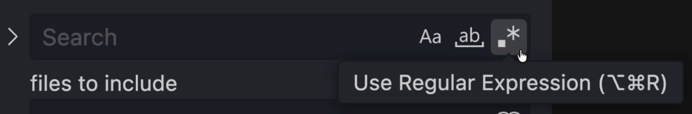
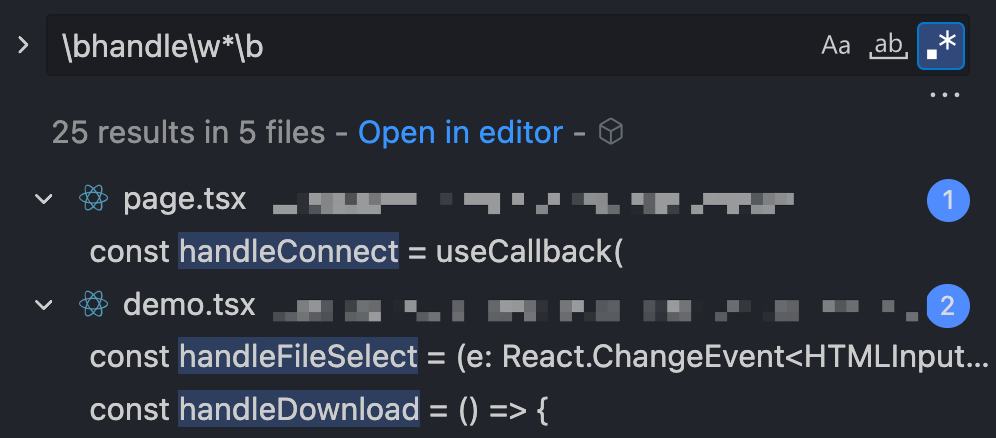
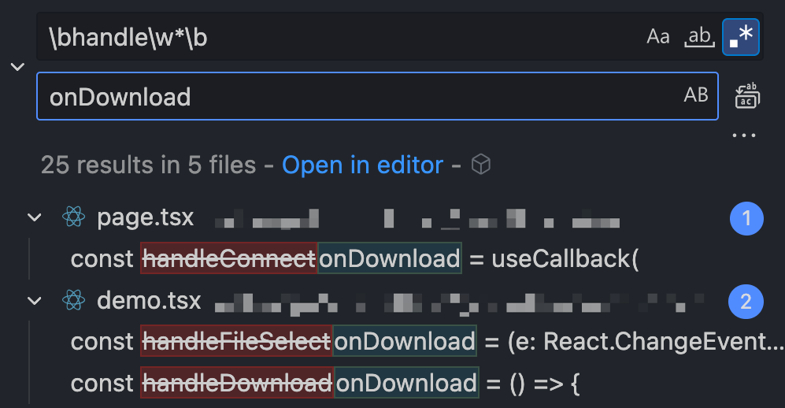
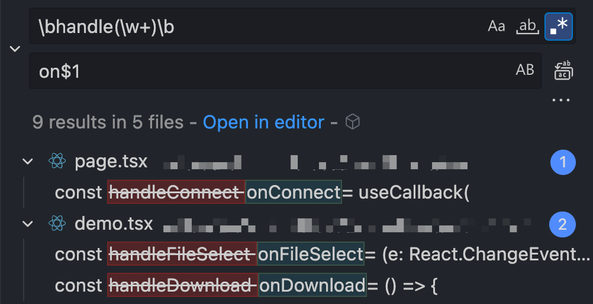

We've all used <kbd>Command</kbd> + <kbd>Shift</kbd> + <kbd>F</kbd> to search across our codebases. There's a hidden gem here which helps us supercharge our search queries — regex (**Reg**ular **Ex**pression) search:


Let's take a look at how can leverage regex to:

1. **Find** (locate patterns that normal search can't detect)
2. **Find & Replace** (Use [groups and backreferences](https://developer.mozilla.org/en-US/docs/Web/JavaScript/Guide/Regular_expressions/Groups_and_backreferences) in regex to replace patterns)

## Scenario 1: Find

Everything a normal text search can do **+** stuff like:

    - Find `TODO` comments mentioning a specific user - `\/\/\s*TODO:.*username`
      
    - Locate all console logs - `console\.(log|warn|error)\(`
    - and many more…

Time for an interesting example:

### Find incorrect usages of dynamic classes in Tailwind

One day you stumble upon this code:

```tsx
<div className={`text-${error ? 'red' : 'green'}-600 text-sm`} />
```

At first glance, it looks fine — but Tailwind can’t understand it.

**Why?** Tailwind scans your files for exact string matches like `text-red-600`, not expressions that dynamically generate class names. It won't see `text-${…}` at all and those styles will be ignored. ([more context](https://tailwindcss.com/docs/detecting-classes-in-source-files#dynamic-class-names))

Here's what the correct code should look like:

```tsx
<div className={`${error ? 'text-red-600' : 'text-green-600'} text-sm`} />
```

Being a good developer, you decide to find and fix all the instances in your codebase… But how !?

#### Here's what we can do:

    1. Identify the pattern: The problem boils down to finding all classes which contain "`-${`"<br/>(which is a hyphen, followed by [template literals](https://developer.mozilla.org/en-US/docs/Web/JavaScript/Reference/Template_literals)).
    2. **Use AI to quickly generate a regex** - `"className=\{`[^`]_-\$\{[^`]_`"`<br/>_Apologies to all the 10x devs, sorry, it's hard to remember the syntax_
    3. Enable regex search (press `.*` beside your search input) and search.<br/>_I sometimes forget to do this and wonder what went wrong_ :)

## Scenario 2: Find and Replace

When you think about "replacing" text with regex, you may wonder:

### How is it possible to replace pattern-matched text correctly?

Say you want to find all function names in your code that start with `handle`.
You could use this regex: `\bhandle\w*\b`



This matches words like `handleConnect`, `handleDownload`, `handleSubmit`, etc.

Now, suppose you want to rename all these to start with `on` instead of `handle` —
so `handleConnect` becomes `onConnect`, `handleDownload` becomes `onDownload`, etc.

If you just try replacing everything with `"on"` or `"onDownload"`, it won’t work.
It’ll overwrite every match with the same thing:



That's not what we want. We need a way to capture and reuse the rest of the word after “handle”.
Let's see how to do that.

### Groups and Backreferences in Regex

Groups let us capture parts of a pattern which we can then reuse while replacing our text.
We define a group by wrapping the pattern in a parentheses `()` .

Here's how we can use this in our example above:

- **Find:** `\bhandle(\w+)\b`<br/>This captures whatever comes after `handle` (like `Connect`, `Download`, etc.) inside the parentheses.
- **Replace:** `on$1`<br/>`$1` refers to the first captured group — the part matched by `(\w+)`

(If you had multiple groups, you could access them as `$2`, `$3`, and so on)



This is EXACTLY what we wanted!

I hope this was interesting and you found a way to save a teeny-tiny bit of your time which you can now use to scroll reels :)
